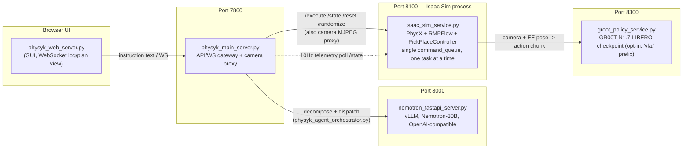
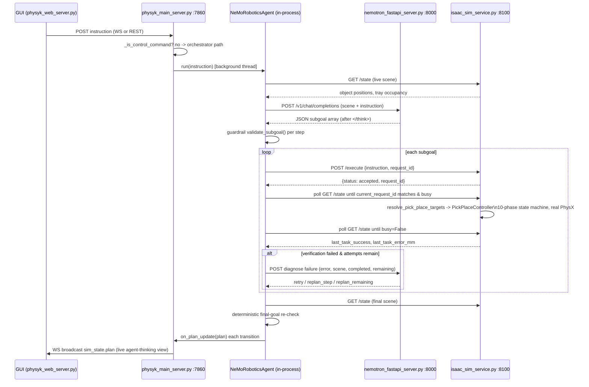

# Physyk — Architecture

Agentic pick-and-place: a Franka Panda arm in Isaac Sim, commanded in natural language,
planned by Nemotron-30B, executed by NVIDIA's validated `PickPlaceController`, and
verified against real simulator telemetry — not scripted, not hardcoded PASS.

This doc covers two levels:

1. **How pick-and-place actually executes**, physically, inside Isaac Sim.
2. **How the agentic orchestration layer** (Nemotron decomposition → guardrails →
   dispatch → verify → retry/replan) turns a free-form instruction into a sequence of
   those pick-and-place calls.

---

## 1. Service topology

Four independent processes, talking over plain HTTP on localhost. Nothing here is a
framework abstraction — every arrow below is a real `urllib`/`httpx` call.



**Key files by role:**

| Role | File | Port |
|---|---|---|
| Gateway / GUI backend, camera proxy, WS broadcast | `physyk_main_server.py` | 7860 |
| Agentic orchestrator (Nemotron client, guardrails, dispatch/verify loop) | `physyk_agent_orchestrator.py` | — (imported by main server) |
| Nemotron-30B server (vLLM, OpenAI-compatible) | `nemotron_fastapi_server.py` | 8000 |
| Isaac Sim physics + PickPlaceController + telemetry + camera streams | `isaac_sim_service.py` | 8100 |
| GR00T-N1.7-LIBERO VLA inference server (separate venv) | `groot_policy_service.py` | 8300 |
| Legacy/dead motion code (unreachable, candidate for deletion) | `physyk_lula_controller.py` | — |

---

## 2. Pick-and-place — the physical execution primitive

This is the one reliable primitive everything else is built on: **one named object →
one resolved 3D position → NVIDIA's validated `PickPlaceController`.** It lives entirely
inside `isaac_sim_service.py`'s single-threaded sim loop (PhysX + RMPFlow — no LLM
involved at this layer).

```mermaid
flowchart TD
    A["POST /execute\n{instruction: 'pick up the green cube\nand place it right of red cube in tray'}"] --> B["command_queue.put((request_id, instruction))"]
    B --> C{"sim loop:\nactive_pick_place is None\nAND queue not empty?"}
    C -- "no, busy" --> C
    C -- "yes" --> D["resolve_pick_place_targets(instruction)"]

    D --> D1["_find_object_mentions()\nkeyword-match cube/tray names by\nstring position in instruction"]
    D1 --> D2{"spatial relation phrase found?\n(right of / left of / on top of / ...)"}
    D2 -- "yes" --> D3["reference_key = object named\nAFTER the relation phrase\npick target = first OTHER mention"]
    D2 -- "no" --> D4["pick target = first object mentioned"]
    D3 --> E
    D4 --> E["picking_position = live position\nof target (get_live_object_pos,\nreal USD query, not cached)"]
    E --> F{"destination type?"}
    F -- "stack (on top of X)" --> F1["placing = ref_pos + [0,0, 2*CUBE_HALF_HEIGHT]"]
    F -- "relation + tray words" --> F2["placing = ref_pos + offset,\nclamped into tray bounds,\nz = tray surface + cube half-height"]
    F -- "'tray'/'bin'/'sort'/... in text" --> F3["_pick_free_tray_slot():\ncenter -> left -> right,\nfirst slot not occupied by\nanother live cube"]
    F -- "no destination" --> F4["placing = picking\n(pick then set back down)"]

    F1 --> G["matched_target, picking_position,\nplacing_position, target_name, reference_key"]
    F2 --> G
    F3 --> G
    F4 --> G

    G --> H["pick_place_controller.reset()\nDisable target (+ reference, if stacking)\nas RMPFlow obstacles; keep every\nOTHER cube/tray as real obstacles"]
    H --> I["active_pick_place = {...}\nsim_telemetry.busy = True"]

    I --> J["every sim frame:\npick_place_controller.forward(\n  picking_position, placing_position,\n  current_joint_positions, EE_OFFSET)"]
    J --> K["10-phase grasp state machine\n(NVIDIA PickPlaceController, RMPFlow cspace)"]

    K --> P0["0 Moving Above Target"]
    P0 --> P1["1 Descending to Grasp"]
    P1 --> P2["2 Settling Before Grasp"]
    P2 --> P3["3 Closing Gripper\n(held_object_key = target)"]
    P3 --> P4["4 Lifting"]
    P4 --> P5["5 Transporting to Place XY"]
    P5 --> P6["6 Descending to Place Height"]
    P6 --> P7["7 Releasing Gripper\n(held_object_key = None)"]
    P7 --> P8["8 Ascending"]
    P8 --> P9["9 Returning to Staging Position"]

    P9 --> L{"pick_place_controller.is_done()?"}
    L -- "no" --> J
    L -- "yes" --> M["REAL post-place verification:\nfinal_pos = get_live_object_pos(target)\nerr_xy = hypot(dx, dy) vs POSITION_XY_TOLERANCE_M\nerr_z = abs(dz) vs POSITION_Z_TOLERANCE_M"]
    M --> N{"err_xy AND err_z\nwithin tolerance?"}
    N -- "yes" --> O1["last_task_success = True\nlast_task_error_mm = err_xy"]
    N -- "no" --> O2["last_task_success = False\nlast_task_error_mm = err_xy"]
    O1 --> Q["re-enable target/reference as obstacles\nactive_pick_place = None, busy = False\nstage = READY"]
    O2 --> Q
```



**Notable engineering details baked into this path** (from `PLAN.md`, verified live —
not aspirational):

- Joints are PD-driven through real PhysX (`ArticulationAction`), not
  `set_joint_positions()` snapping — the earlier version bypassed physics entirely.
- `panda_finger_joint2` originally shipped with zero drive strength (one-finger grasp
  bug) — fixed at the asset level.
- Obstacles are registered with RMPFlow (table, tray, other cubes) and
  disabled/re-enabled per-task so the arm can approach the object it's actually
  grasping without RMPFlow treating it as something to avoid.
- `resolve_pick_place_targets` uses the target's **live** Z, not an assumed
  table-height constant — needed for picking a cube that's already stacked.
- Verification (`last_task_success` / `last_task_error_mm`) used to be a hardcoded
  `position_error_mm: 0.0` / always-PASS stub; it is now a real position comparison —
  this is the load-bearing signal the orchestrator's retry/replan logic depends on.
- Every `/execute` call gets a unique `request_id`; `current_request_id` in `/state`
  lets a caller confirm the sim actually started *this* dispatch (not stale telemetry
  from a previous or concurrent command) — see §4 below.

**Alternate executor — GR00T-N1.7 VLA (`vla:` prefix, opt-in):** live camera + EE pose →
real forward pass on the LIBERO checkpoint (port 8300) → 16-step delta action chunk →
RMPFlow execution, re-observing every chunk (max 4 chunks/task). Genuinely
image-conditioned (verified: 3 different synthetic images → 3 different predicted
actions), but out-of-domain for this scene, so `PickPlaceController` remains the
default path; VLA is a stretch/demo path, not what the orchestrator dispatches to.

---

## 3. Agentic orchestration — Nemotron-driven plan → guardrail → dispatch → verify loop

This is `physyk_agent_orchestrator.py`'s `NeMoRoboticsAgent.run()` — the actual
hackathon deliverable per `PLAN.md` Part 2. It is a pure HTTP client of two already-
running servers (Nemotron on 8000, Isaac Sim on 8100); no model is loaded in-process,
so it stays cheap to import into `physyk_main_server.py`'s plain-python3 process.

```mermaid
flowchart TD
    START(["free-form instruction arrives\nvia physyk_main_server.py execute_instruction()"]) --> CTRL{"plain control command?\n(reset/home/randomize/'vla:')"}
    CTRL -- "yes" --> DIRECT["_forward_direct_to_isaac()\nsingle-shot, no LLM"]
    CTRL -- "no" --> LOCK{"_orchestrator_lock\nfree?"}
    LOCK -- "no" --> BUSY(["reject: orchestrator\nalready running a plan"])
    LOCK -- "yes" --> RUN["NeMoRoboticsAgent.run()\n(background thread)"]

    RUN --> SCENE["fetch_live_scene()\nGET isaac_sim_service /state\n(real object positions, not cached)"]
    SCENE --> DECOMP["decompose_task():\nPOST Nemotron /v1/chat/completions\nsystem prompt = scene description +\nsubgoal-shape spec, temperature=0"]
    DECOMP --> PARSE["_parse_subgoals():\nstrip chain-of-thought before </think>,\ntake LAST JSON array in the answer"]
    PARSE --> EMPTY{"subgoals empty\nor unparsable?"}
    EMPTY -- "unparsable/unreachable" --> FALLBACK["fallback: single 'direct' subgoal\n= dispatch instruction verbatim"]
    EMPTY -- "empty (legit — no\nmatching object)" --> REJECT(["overall = REJECTED\nnothing dispatched"])
    EMPTY -- "no" --> STEPLOOP

    FALLBACK --> STEPLOOP["for each subgoal, in order:"]

    subgraph STEP["Per-subgoal loop"]
        direction TB
        S1["validate_subgoal():\nPhysicalWorkspaceRails.validate_cartesian_target()\nreject targets outside\nx:[0.20,0.70] y:[-0.45,0.45] z:[0.02,0.50]"]
        S1 -- "fails guardrail" --> S1R(["REJECTED, skip step"])
        S1 -- "passes" --> S2{"_subgoal_already_satisfied()?\n(deterministic position check —\nis target already at destination)"}
        S2 -- "yes" --> S2D(["DONE — skipped, no re-dispatch"])
        S2 -- "no" --> S3{"_subgoal_drift_detected()?\n(pre-dispatch perceive check:\nreference object out of tray, OR\nmoved since an earlier step\nverified its placement)"}
        S3 -- "drifted" --> S3F["request_failure_decision()\n(Nemotron diagnoses BEFORE dispatch)"]
        S3F --> S3D["apply decision: replan_step /\nreplan_remaining (once/run) / proceed"]
        S3D --> S4
        S3 -- "no drift" --> S4["subgoal_to_instruction()\n-> plain text, e.g.\n'pick up the X and place it Y'"]
        S4 --> S5["_dispatch(): POST /execute,\nblock until /state.current_request_id\n== our request_id (confirms THIS\ndispatch was actually dequeued)"]
        S5 --> S6["_wait_for_idle(): poll /state\nuntil busy=False, timeout=150s\n(timeout counts as FAILED,\nnever a silent success)"]
        S6 --> S7{"subgoal.action == pick_place?"}
        S7 -- "no (home/reset/direct)" --> S9D(["DONE"])
        S7 -- "yes" --> S8{"last_task_success == True?\n(real telemetry from §2's\nverification step)"}
        S8 -- "yes" --> S9D
        S8 -- "no, attempts remain\n(max 3)" --> S10["request_failure_decision():\nNemotron sees real error_mm,\ncompleted steps, remaining plan,\nlive scene -> retry / replan_step /\nreplan_remaining (once/run)"]
        S10 --> S5
        S8 -- "no, attempts exhausted" --> S9F(["FAILED —\nabort remaining plan,\nmark later steps ABORTED"])
    end

    STEPLOOP --> STEP
    STEP -- "next subgoal" --> STEP
    STEP -- "all subgoals processed" --> FINAL["Deterministic final-goal check\n(code only, NO extra LLM call):\nre-compare every DONE step's\nrecorded final_pos against its\nCURRENT live position — did a\nLATER step disturb an EARLIER,\nalready-verified placement?"]

    FINAL --> VERDICT{"overall verdict"}
    VERDICT -- "all done + goal holds" --> SUCCESS(["SUCCESS"])
    VERDICT -- "all done, later step\ndisturbed an earlier one" --> GNH(["GOAL_NOT_HELD"])
    VERDICT -- "some done, some failed" --> PARTIAL(["PARTIAL"])
    VERDICT -- "none done" --> FAILED(["FAILED"])

    SUCCESS --> EMIT["on_plan_update(plan) after every\nstate transition -> sim_state.plan\n-> WS broadcast -> live GUI plan view"]
    GNH --> EMIT
    PARTIAL --> EMIT
    FAILED --> EMIT
```



### Why the failure-handling loop looks the way it does

Each design choice below closes a *specific, live-reproduced* bug — not a hypothetical:

- **`request_id`-based dispatch confirmation** (`_dispatch`) is the third iteration. Plain
  polling-for-idle raced the ~7-8fps sim loop; `busy=True` alone was true for *anyone's*
  in-flight task; text-matching the instruction broke on identical retries. A unique
  per-call `request_id`, echoed back in `/state.current_request_id`, removes all three
  ambiguities.
- **Timeout ≠ success.** `_wait_for_idle` timing out used to fall through to reading
  `last_task_success`, which is leftover state from whatever task last genuinely
  finished — possibly unrelated. A timeout is now always a failed attempt.
- **Precondition check (`_subgoal_already_satisfied`)** — re-running a compound
  instruction like "stack red, green, blue" after red is already placed used to
  re-pick a correctly-placed cube instead of recognizing the goal already held.
- **Pre-dispatch drift check (`_subgoal_drift_detected`)** — two independent checks:
  (1) absolute — is a stacking reference *actually* in the tray right now, not just
  unchanged since last look; (2) relative — has a reference object moved beyond
  tolerance since the earlier step that placed it was verified. Neither alone caught
  both real failure modes observed live (a cube that fell out of the tray and just sat
  there wrong vs. a reference cube that got knocked by a later grasp).
- **One LLM call per failure**, not a fixed retry-then-give-up schedule and not a
  separate "decide" + "replan" call — `request_failure_decision()` returns
  `retry` / `replan_step` / `replan_remaining` (capped at once per run, to prevent a
  runaway replan loop) in a single structured response.
- **Deterministic final-goal check** — every individual step can verify PASS on its
  own and the *original* compound goal can still be false if a later step (e.g. a
  stack) physically disturbed an earlier, already-verified placement. This check is
  pure position math against telemetry, deliberately not another LLM call.

---

## 4. Full request lifecycle — a single compound instruction

End-to-end trace for something like *"put the green cube in the tray, then stack the
blue cube on the red cube"*, tying §1–§3 together with concrete field names.



---

## 5. State model reference

**`isaac_sim_service.py` → `sim_telemetry`** (polled by main server at 10Hz, source of
truth for the physical robot):

```
joints, gripper, ee_pos, stage, busy, last_instruction, fps,
current_request_id, last_task_success, last_task_error_mm
```

**`physyk_agent_orchestrator.py` → `plan` dict** (drives the live agent-thinking UI via
`on_plan_update`, independent of the text log):

```
{
  instruction, active, overall: PLANNING|RUNNING|VERIFYING|
                                 SUCCESS|GOAL_NOT_HELD|PARTIAL|FAILED|REJECTED,
  steps: [
    { index, text, subgoal: {action, target, destination},
      status: PENDING|RUNNING|RETRYING|REPLANNING|DONE|FAILED|REJECTED|ABORTED,
      detail, final_pos }
  ]
}
```

---

## 6. Known gaps (honest, per `PLAN.md`)

- GR00T-N1.7-LIBERO VLA path does real inference but does not reliably complete the
  task on this scene (out-of-domain checkpoint, not fine-tuned here) — kept opt-in,
  `PickPlaceController` is the default/reliable executor.
- No N-trial randomized batch success-rate run yet (real verification only landed
  recently — this is the natural next measurement).
- `physyk_lula_controller.py` is confirmed dead code (unreachable legacy-namespace
  bug) — candidate for deletion, not currently wired into any live path.
