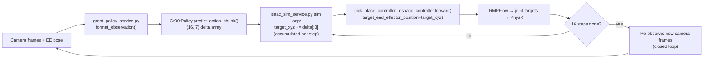
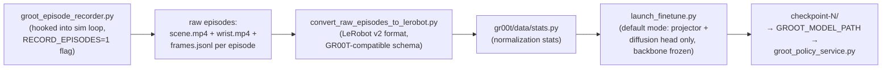
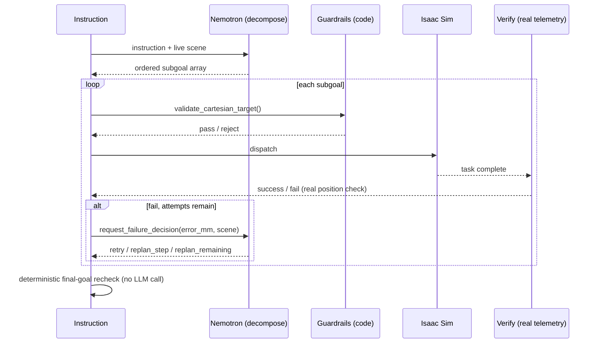

# Physyk — Technical Deep Dive

Reference doc for demo/Q&A prep. Goes one level deeper than `ARCHITECTURE.md` on how each
piece actually works: the pick-and-place execution primitive, inverse kinematics and collision
avoidance, GR00T-N1.7 VLA, Nemotron orchestration, and Cosmos-Reason2 perception. Every claim
below traces to a specific file/line in the codebase — nothing here is aspirational.

For the service topology (4 processes, ports, request lifecycle) see `ARCHITECTURE.md` §1 and
§4 — not repeated here.

---

## 1. Pick-and-place execution — the physical primitive

### 1.1 The 10-phase grasp state machine

Every pick-and-place task, whether dispatched directly or via the Nemotron orchestrator, ends
up calling NVIDIA's own validated `PickPlaceController` (`isaacsim.robot.manipulators`), driven
once per physics frame from `isaac_sim_service.py`'s sim loop:

```mermaid
flowchart LR
    P0["0 Moving Above Target"] --> P1["1 Descending to Grasp"]
    P1 --> P2["2 Settling Before Grasp"]
    P2 --> P3["3 Closing Gripper"]
    P3 --> P4["4 Lifting\n(grasp-confirmed here)"]
    P4 --> P5["5 Transporting to Place XY"]
    P5 --> P6["6 Descending to Place Height"]
    P6 --> P7["7 Releasing Gripper"]
    P7 --> P8["8 Ascending"]
    P8 --> P9["9 Returning to Staging"]
    P9 --> V["Real position verification\n(live telemetry vs target)"]
```



Two engineering details worth knowing cold for Q&A:

- **Grasp confirmation is physical, not assumed.** At the phase-3→4 transition, the code reads
  the gripper's actual achieved joint width and checks it against `GRASP_MIN_WIDTH_M` (a
  gripper that closed on nothing settles near its mechanical minimum, not near a cube's real
  width). A failed grasp **early-aborts** the task instead of running phases 5-9 with nothing
  held — this closes a real bug where a failed grasp used to silently run the whole ~30-40s
  motion before anyone found out.
- **A second, related bug found and fixed this session**: `PickPlaceController.reset()` only
  resets the state machine's phase/timer — it never physically re-opens the gripper. A failed
  grasp (which early-aborts before reaching the release phase) left the jaws physically closed,
  so the *next* task began with an already-shut gripper — guaranteed to fail the same way,
  producing visible failure streaks. Fixed by explicitly calling `robot.gripper.open()` at
  every task-start and every abort/reset path.

### 1.2 Inverse kinematics — what's actually used (and what isn't)

The file initializes **two separate IK-capable systems**, but only one is actually load-bearing:

- **`LulaKinematicsSolver`** (`isaac_sim_service.py:715-717`) — NVIDIA's Lula IK engine,
  loaded via `load_supported_lula_kinematics_solver_config("Franka")` (NVIDIA's own bundled
  Franka config, not a custom URDF). **This solver is instantiated and then never referenced
  again anywhere in the file.** It is dead code today — evaluated, wired up, not used for any
  actual motion.
- **RMPFlow**, via `PickPlaceController._cspace_controller` — this is what actually computes
  every joint target in the system, for both the scripted path and the VLA path (the VLA loop
  calls `pick_place_controller._cspace_controller.forward(...)` directly, bypassing the phase
  state machine but still using the same RMPFlow instance).

**Good, honest Q&A answer**: *"We evaluated NVIDIA's Lula kinematics solver and RMPFlow side by
side; RMPFlow's built-in collision-aware planning made it the right default for everything, so
Lula's solver is initialized but not currently wired into the motion path."*

### 1.3 Collision avoidance — RMPFlow obstacle registration

RMPFlow does not automatically know about scene geometry — every obstacle has to be explicitly
registered (`isaac_sim_service.py:769-775`):

```python
rmpflow_motion_policy.add_obstacle(work_table_obj, static=True)
rmpflow_motion_policy.add_obstacle(target_tray_obj, static=True)
for cube_obj in CUBE_OBJECTS.values():
    rmpflow_motion_policy.add_obstacle(cube_obj, static=False)
```

Table and tray are **permanent static obstacles**. All three cubes are **dynamic obstacles** —
critically, this means the arm routes *around* whichever cubes it isn't currently interacting
with. The cube currently being picked (and, for a "stack on X" task, the reference cube being
stacked onto) is **temporarily disabled** as an obstacle for the duration of that one task via
`disable_obstacle`/`enable_obstacle` calls, then re-enabled once the task completes — otherwise
RMPFlow would refuse to let the gripper approach and enclose its own pick target.

This obstacle-registration step didn't always exist — an earlier version of the system had zero
registered obstacles, meaning the arm could clip straight through the table or other cubes; this
was one of the first real physics bugs found and fixed in the project's history.

---

## 2. GR00T-N1.7 — Vision-Language-Action model

### 2.1 Architecture (from the loaded checkpoint's own `config.json`)

| Component | Value |
|---|---|
| Model type | `Gr00tN1d7` |
| Vision-language backbone | `nvidia/Cosmos-Reason2-2B` (Qwen3-VL architecture) |
| Backbone layers used | 16 (`select_layer: 16`) |
| Backbone embedding dim | 2048 |
| Action head | Flow-matching diffusion transformer (DiT) |
| Action head layers / heads | 32 layers, 32 attention heads, head dim 48 |
| Diffusion inference steps | 4 (`num_inference_timesteps: 4`) |
| Max state / action dim | 132 |
| Model action horizon (architecture cap) | 40 |
| Image processing | 256×256 target, 230×230 crop, 0.95 crop fraction |
| Precision | bfloat16 |

**A note on precision worth having ready**: NVIDIA's own Isaac-GR00T repo README states N1.7's
default diffusion head as 16 layers (down from 32 in N1.6) and `select_layer: 12` — but this
project's actual loaded checkpoint (`GR00T-N1.7-LIBERO`) shows `num_layers: 32` and
`select_layer: 16` in its own `config.json`. Rather than guess which is "right," both numbers
are cited here — the checkpoint's own file is authoritative for what's actually running, and
likely reflects an earlier fine-tune snapshot from before those defaults changed upstream.

GR00T N1.7's real architectural headline (per the repo README) is a **relative end-effector
action space** shared across robot and human demonstration data — deltas from the current pose
rather than absolute targets, which is the mechanism that lets the same model architecture
pretrain on ~20K hours of human egocentric video and transfer to robot control.

### 2.2 What this project actually sends the model

Only two RGB camera frames, proprioception, and language — **no depth**, confirmed at the exact
call site (`isaac_sim_service.py`'s `query_groot_server`):

```python
payload = {
    "instruction": instruction,
    "scene_image_b64": ...,   # scene/front camera, JPEG
    "wrist_image_b64": ...,   # wrist camera, JPEG
    "ee_pose": [x, y, z, roll, pitch, yaw],
    "gripper_width": ...,
}
```

This isn't a plumbing gap — the checkpoint's own `LIBERO_PANDA` modality config has no depth
channel defined at all. GR00T-N1.7-LIBERO is, by design, a pure RGB+proprioception+language
model here. (Cosmos-Reason2 does compute real depth elsewhere in this project — see §4 — but it
isn't fed into GR00T.)

### 2.3 From prediction to motion — the exact chain



Up to **4 chunks per task** (64 total delta-steps), each chunk followed by a fresh
observation — genuinely closed-loop, not a single blind prediction. This is opt-in via a
`vla:` instruction prefix; the scripted `PickPlaceController` path (§1) remains the default,
reliable executor.

### 2.4 This project's fine-tuning pipeline (built this session)



The recorder is a genuinely non-invasive hook — 4 small additions to `isaac_sim_service.py`,
gated behind an env flag, using data (raw camera frames, `sim_telemetry["ee_pos"]`/`gripper`)
that already existed in the sim loop. Only **successful** episodes (per the same real
verification described in §1.1) are written to disk — failed attempts are silently dropped, so
the dataset never needs a separate filtering pass.

**Real runs this session, honestly reported:**

| Dataset | Episodes | Steps | Train loss | Closed-loop result |
|---|---|---|---|---|
| `physyk_cubes_17` | 17 (mixed 3-color) | 1000 | ~0.04 (exact log not retained) | Moves, doesn't converge — near-identical deltas every chunk |
| `physyk_red_21` | 21 (red-only) | 1000 | 0.0425 | Same symptom, marginally different deltas |
| `physyk_red_54` | 54 (red-only, current default) | 1500 | 0.0402 | Deltas shrink chunk-over-chunk (real signal) but still doesn't reliably grasp |

**The honest finding worth stating directly in Q&A**: training loss dropping to ~0.04 does
**not** mean closed-loop task success. That number only measures "did the model predict
something close to what the demonstration did at that exact frame" — it says nothing about
whether the robot completes the task when run in a real feedback loop, where small per-step
errors compound (a well-known imitation-learning failure mode called distribution shift). With
54 episodes that are all structurally near-identical (same cube, same tray, same camera, only
start position varying), the model shows real signs of learning trajectory *shape* without yet
learning to condition tightly enough on *where the cube actually is*. The next lever, based on
this evidence, is more positional/visual diversity in the data — not just more of the same.

---

## 3. Nemotron — agentic orchestration

*(Full architecture and diagrams: `ARCHITECTURE.md` §3-4. This section goes one level deeper
on the actual prompts/schemas.)*

**Serving**: Nemotron-30B-FP8 via vLLM, OpenAI-compatible API on port 8000
(`--max-model-len 12288`, `--gpu-memory-utilization 0.48-0.55` depending on what else is
sharing the GPU).

### 3.1 Decomposition — exact schema

The orchestrator's system prompt (`physyk_agent_orchestrator.py:342-386`) instructs Nemotron to
output an ordered JSON array where every element is exactly one of:

```json
{"action": "pick_place", "target": "<object name>", "destination": "<free text or empty>"}
{"action": "home"}
{"action": "reset"}
```

Key rules baked into the prompt: never invent objects not in the live scene description; one
subgoal per "and/then/after that" clause; but a single-object pick-and-place-in-the-same-clause
stays **one** subgoal, not two; never invent a destination the user didn't state
(`destination: ""`).

### 3.2 Guardrails — deterministic, not LLM-judged

`PhysicalWorkspaceRails` (`physyk_agent_orchestrator.py:85-102`) rejects any Cartesian target
outside a fixed box **before dispatch**, in code, with no LLM in the loop:

```
x: [0.20, 0.70]   y: [-0.45, 0.45]   z: [0.02, 0.50]   (meters)
```

Beyond the workspace box, several other checks are pure code, deliberately not LLM calls, for
speed and determinism:

- `_subgoal_already_satisfied` — is the goal already true (avoids re-picking an already-placed
  cube on a re-run of a compound instruction).
- `_reference_out_of_tray` / `_subgoal_drift_detected` — did a stacking reference object
  physically move or leave the tray since an earlier step verified it, before dispatching the
  next step that depends on it.

### 3.3 Failure handling — the 3-way decision

On a verification failure, `request_failure_decision` posts the real error (`error_mm`),
completed/remaining subgoals, and the live scene to Nemotron, which must return exactly one of:

| Decision | Effect |
|---|---|
| `retry` | One-off physical miss — redispatch the same subgoal |
| `replan_step` | Replace just the failed subgoal's destination, keep the rest |
| `replan_remaining` | Regenerate the entire remaining plan |

Capped at once per run to prevent a runaway replan loop. LLM JSON output is parsed with a
custom balanced-brace extractor (`_extract_json_objects`) — built specifically because a naive
regex broke on nested JSON objects in real Nemotron output.



---

## 4. Cosmos-Reason2 — perception, real vs. designed

This is worth stating clearly because it's easy to assume a perception-integration doc is
aspirational: **it is not — the shadow-mode integration described in `cosmos_integration.md`
is actually implemented and running**, not just planned.

**Serving**: Cosmos-Reason2-2B via vLLM, port 8001, `--reasoning-parser qwen3` (Cosmos-Reason2
is built on the Qwen3-VL architecture — the same backbone family GR00T-N1.7 itself uses for its
vision-language encoder, a deliberate ecosystem-consistency choice worth naming in Q&A).

### 4.1 Three-mode perception seam

- **`stage`** — ground-truth USD object poses drive the robot (the original, always-correct
  baseline).
- **`shadow`** (current default, `PERCEPTION_MODE` env var) — stage pose still drives the
  robot; Cosmos runs in parallel on the same scene and its estimate is only **logged as a
  delta**, zero risk to reliability. This is the safety-first default.
- **`vision`** — Cosmos's own deprojected pose estimate would actually drive IK, gated by an
  8cm sanity threshold with automatic fallback to stage pose on failure or an out-of-gate
  delta. Implemented, not currently the default.

### 4.2 Real call sites

- **Pre-dispatch visual assessment** (`_attach_cosmos_assessment`,
  `physyk_agent_orchestrator.py:794`) — before a subgoal is dispatched, Cosmos is asked to
  visually assess feasibility (object visible/accessible, path clear) and the result is logged.
- **Post-dispatch visual verification** (~line 762) — after motion completes, Cosmos is asked
  to visually confirm the outcome (e.g. "is the cube actually on top of the other cube") as an
  independent check alongside the real telemetry-based verification.

Both are logged to the reasoning dashboard (`/reasoning/cosmos`), viewable live alongside
Nemotron's own reasoning log (`/reasoning/nemotron`) and a real-time 4-service status panel
(Isaac Sim / Nemotron / Cosmos / GR00T VLA — all added this session).

---

## 5. Seeing it live

| What | Where |
|---|---|
| Main GUI + live cameras | `http://<host>:7860` |
| 4-service status panel | Header of the main GUI (green/gray pills) |
| Nemotron full reasoning log | `http://<host>:7860/reasoning/nemotron` |
| Cosmos full reasoning log | `http://<host>:7860/reasoning/cosmos` |
| GR00T VLA policy server | `http://<host>:8300/health` |
| Full stack startup | `./run.sh` (starts all 5: Isaac Sim, GUI, Nemotron, Cosmos, GR00T) |
| Scripted-path-only (no orchestrator/perception) | `./run.sh --no-agent` |
| Live status check any time | `./run.sh --status` |
